

  

<h1 align="center">Morph AI</h1>

  <strong>Your always-on chief of staff for scheduling and task management</strong>

  <a href="https://jungwoo-ahn.github.io/morph-ai-docs/">Landing Page</a> &bull;
  <a href="https://morph-ai.app">Try Morph AI</a> &bull;
  <a href="https://jungwoo-ahn.github.io/morph-ai-docs/docs/">Documentation</a>

---

  

<em>Tasks &middot; Calendar &middot; AI Chat — all in one view</em>

  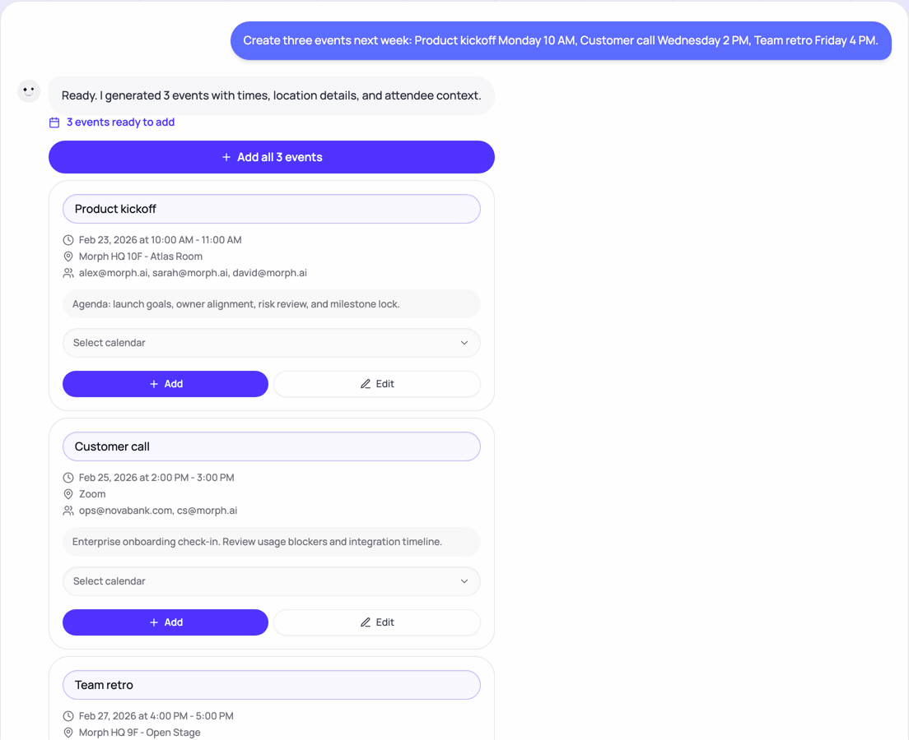

<em>One assistant for text, images, audio, and web search</em>

---

## How it works

Morph turns messy inputs into clean execution. One assistant loop handles **capture, context, search, and execution** — no app switching required.

| Step | What happens |
|------|-------------|
| **Capture** | Understand intent from text, image, PDF, audio, and web context |
| **Context** | Merge Calendar, Tasks, and history into one working memory |
| **Retrieve** | Semantic search over your data finds the right facts fast |
| **Execute + Sync** | Create/update events and tasks, then sync bi-directionally with Google |

---

## Text input

Type naturally — Morph creates events, plans tasks, summarizes schedules, and sets up recurring patterns from a single message.

### Multi-event creation

Add multiple events in one message. Morph parses each one and queues them for your calendar.

  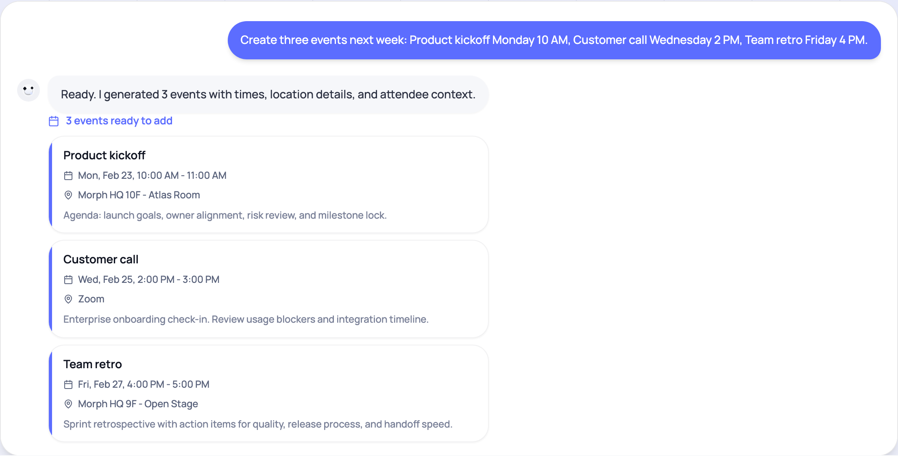

### AI-powered task planning

Break down goals into subtasks and schedule focus time — all from a single message.

  

### Schedule summary

Ask "What does my week look like?" and get a structured overview of meetings, deadlines, and free blocks.

  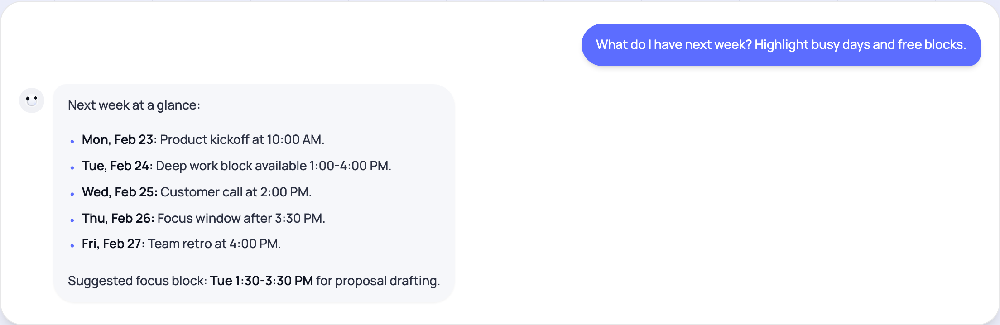

### Recurring events

Set up repeating schedules with natural language. Morph creates the events and syncs with Google Calendar.

  

---

## Image & PDF

Upload a photo of a conference schedule, class announcement, email, or messenger chat — Morph reads it and creates structured events.

  
  
  

  
  
  

### Conference schedule &rarr; filtered events

  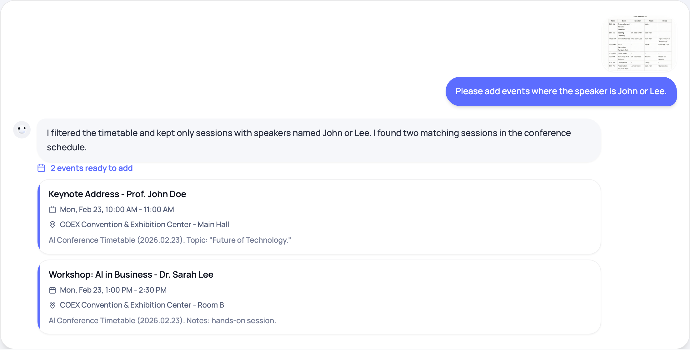

### Messenger chat &rarr; events + tasks

  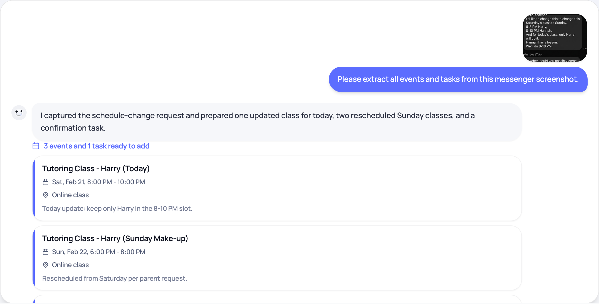

### Email invite &rarr; meeting + prep tasks

  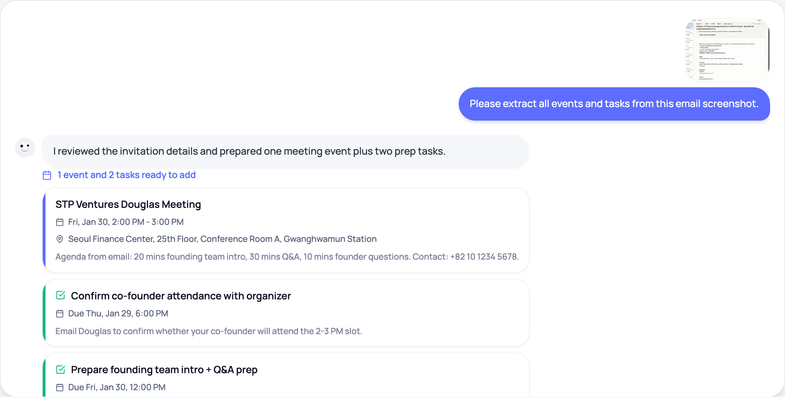

---

## Audio

Record a voice memo, capture a call, or dictate updates. Whisper transcribes the audio, then GPT-4o extracts events and tasks automatically.

### Call recording &rarr; events + action items

  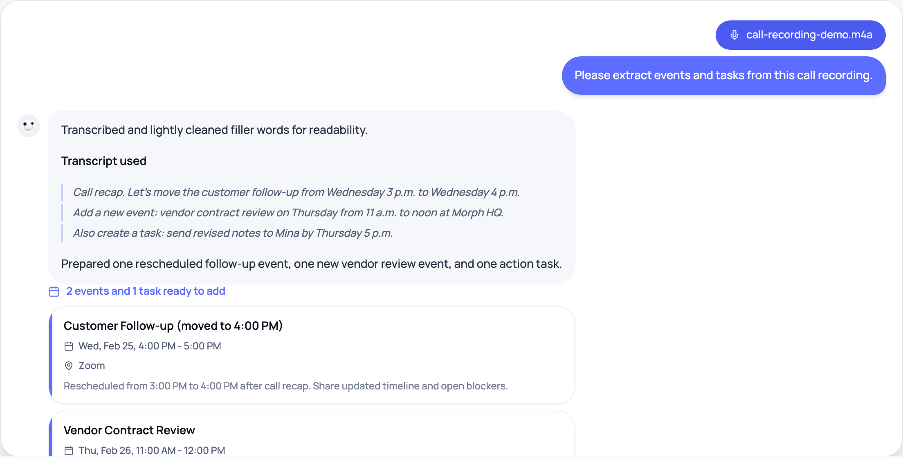

### Voice memo &rarr; event + task

  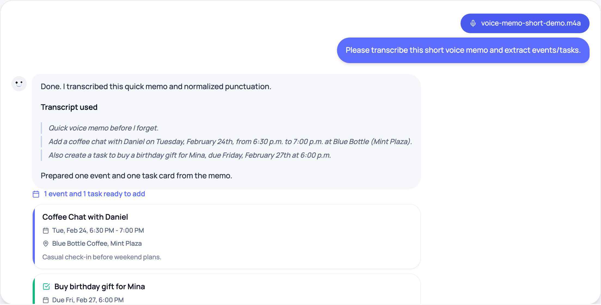

---

## Web search

Ask Morph to look up sports schedules, holidays, deadlines, or travel plans — it searches the web and creates events automatically.

### Sports schedule lookup

  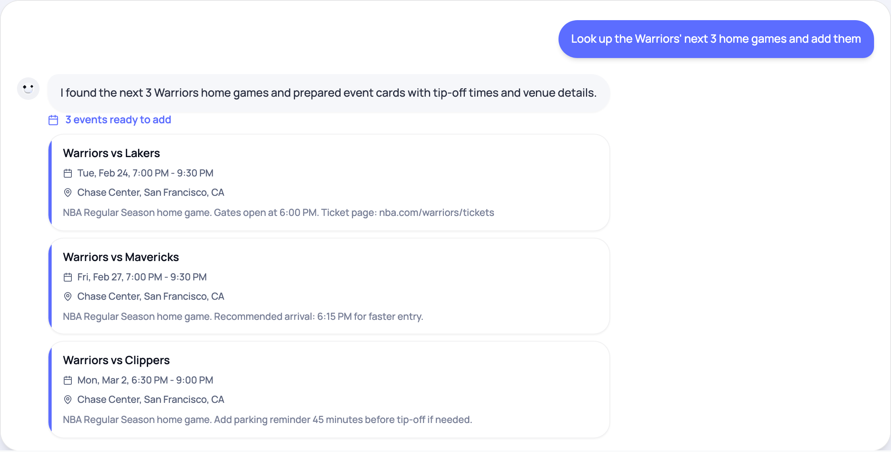

### Federal holidays

  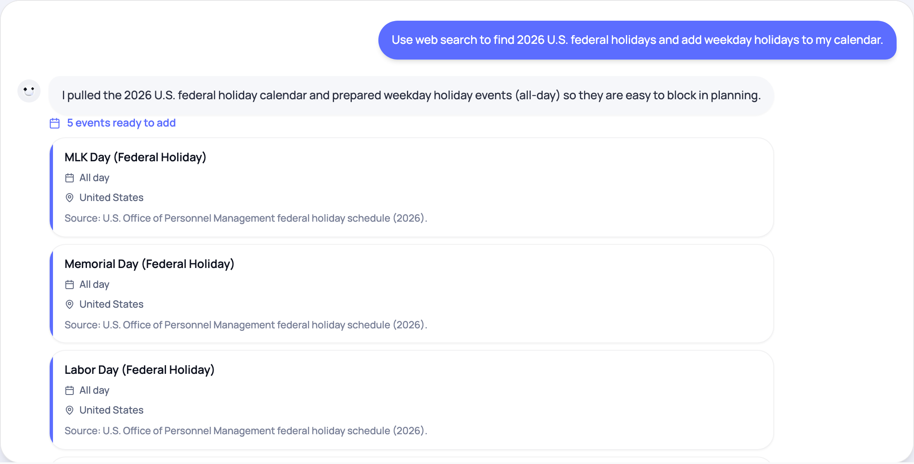

---

## Semantic search

Powered by pgvector embeddings. Ask contextual questions about past events, workload patterns, or upcoming preparations.

### Assignment lookup

  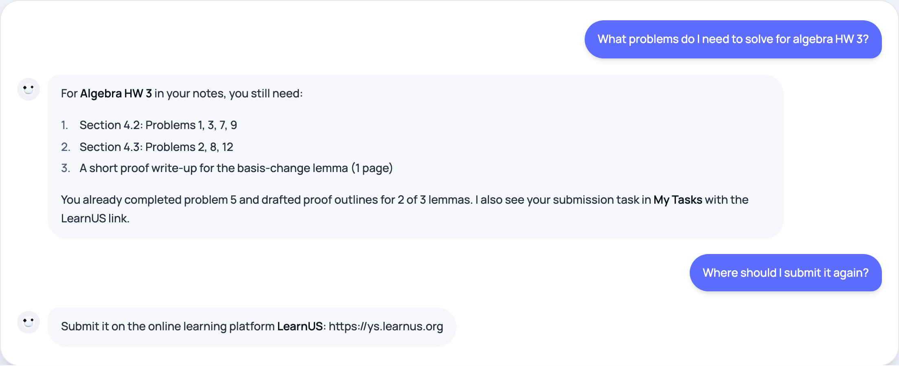

### Workload summary

  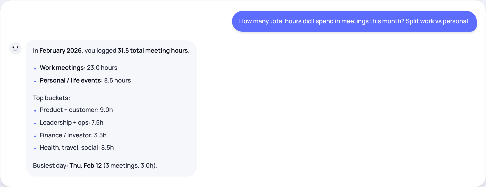

---

## Proactive AI (Coming soon)

Morph monitors your schedule 24/7 and sends intelligent nudges before you ask.

  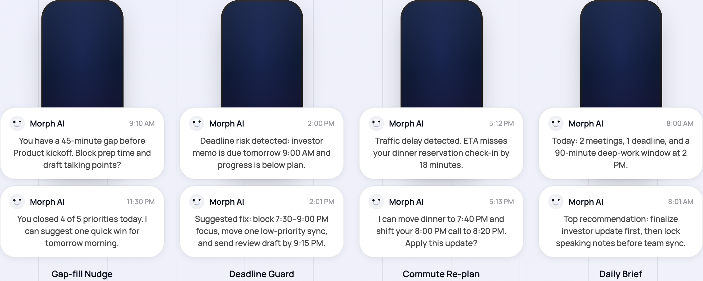

<em>Gap-fill &bull; Deadline guard &bull; Commute replan &bull; Daily brief</em>

  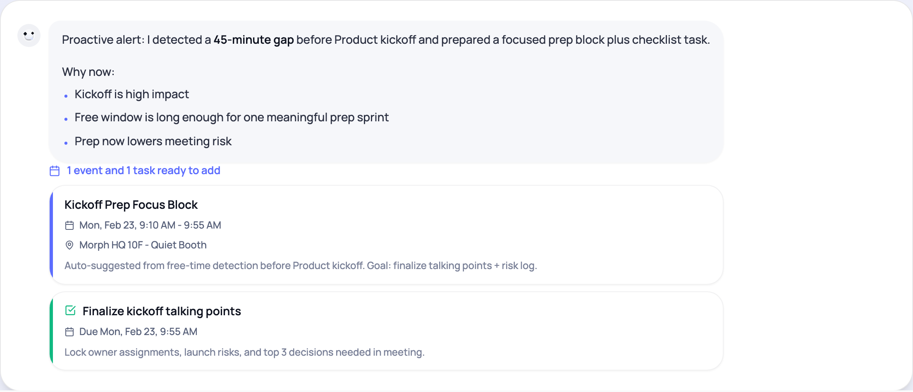

---

## Tech stack

- **Frontend**: Next.js 14, React 18, TypeScript, Tailwind CSS
- **AI**: GPT-4o, GPT-4 Vision, Whisper
- **Database**: PostgreSQL + pgvector (semantic search)
- **Sync**: Google Calendar & Google Tasks (bi-directional)
- **Languages**: 10 languages supported

---

  

  Made by <a href="https://github.com/jungwoo-ahn">Jungwoo Ahn</a>

